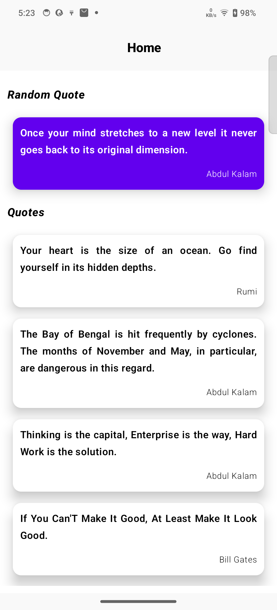
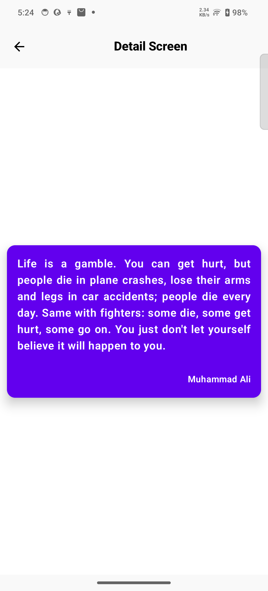

# 📖 MyQuotes App

A modern **Android application** built with **Kotlin** and **Jetpack Compose**, following **Clean Architecture** and **MVVM** principles.  
The app fetches random inspirational quotes and displays them in a simple yet elegant UI.  

✨ This project is a **learning sample** that demonstrates the use of:
- Jetpack Compose for declarative UI
- Kotlin Flow for reactive data streams
- Clean Architecture & MVVM pattern
- Retrofit + OkHttp with logging interceptor
- Dependency Injection (if added later)
- REST API integration using [DummyJSON](https://dummyjson.com/)

---

## 🚀 Features

- 📜 Display random quotes with author name  
- 🔄 Fetch data from [DummyJSON Quotes API](https://dummyjson.com/quotes)  
- 🎨 UI designed fully in **Jetpack Compose**  
- ⚡ Reactive data handling with **Kotlin Flow**  
- 🧩 Clean separation of concerns with **MVVM + Clean Architecture**  
- 📱 Adaptive UI with dynamic height for long quotes  

---

## 🏗️ Architecture Overview

The project is structured using **Clean Architecture** with clear separation of layers:  

## 📷 Screenshots  

| Home Screen | Quote Display |
|-------------|---------------|
|  |  |

## API Reference

Quotes are fetched from DummyJSON Quotes API

Example: GET https://dummyjson.com/quotes/3

{
  "id": 3,
  "quote": "Time is money.",
  "author": "Benjamin Franklin"
}

🎯 Purpose

This is a sample project created for practice and learning:

Jetpack Compose UI development

Implementing Clean Architecture & MVVM

Understanding API integration with Retrofit + Flow

Open-source contribution and portfolio project
